# Segment Anything 2

Segment Anything 2

Meta FAIRJuly 29, 2024

# SAM

SAM

What task will enable zero-shot generalization?
What is the corresponding model architecture?
What data can power this task and model?

Promptable Segmentation
SAM
SA-1B 

# SAM

SAM

Task: Promptable Segmentation

# SAM

SAM

Task: Promptable Segmentation

# SAM

SAM

Task: Promptable Segmentation 

Prompt가 주어지면 유효한 segmentation mask를 반환하는 것
Prompt는 전경/배경 Point, 대략적인 Box 또는 Mask, 자유 형식 Text 또는 일반적으로 이미지에서 segmentation 대상을 나타내는 모든 정보
 “유효한” 마스크는 프롬프트가 모호하고 여러 개체를 참조할 수 있는 경우에 대해 출력이 그 객체 중 적어도 하나에 대한 합리적인 마스크여야 함을 의미

# SAM

SAM

Model: Segment Anything Model

# SAM

SAM

Model: Segment Anything Model

Image encoder 
Prompt encoder
Mask encoder

# SAM

SAM

Model: Segment Anything Model

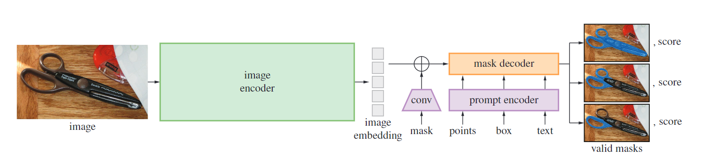

# SAM

SAM

Data: SA-1B Data Engine

 

# SAM

SAM

Data: SA-1B Data Engine

 Assisted-manual: 전문 annotator들이 SAM(Segment Anything Model)을 활용하여 마스크를 수동으로 labeling
 Semi-automatic: 자동으로 신뢰할 수 있는 마스크를 감지 후 이 마스크가 미리 채워진 이미지를 주석자에게 제공하고, 추가로 주석되지 않은 객체를 주석하도록 요청 (다양성 증가)
 Fully automatic: 이미지에 grid point를 찍어서 자동으로 masking

# SAM

SAM

2

# SAM 

SAM 

What task will enable zero-shot generalization?
	→ extending the promptable segmentation task to video

What is the corresponding model architecture?
	→ equipping the SAM architecture to use memory when 		applied to video

What data can power this task and model?
	→ the diverse SA-V dataset for training and benchmarking 	video segmentation

2

# Slide 13

# 

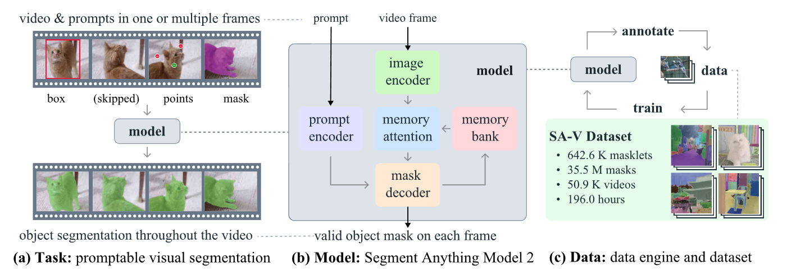

# SAM 2

SAM 2

What task will enable zero-shot generalization?
What is the corresponding model architecture?
What data can power this task and model?

Promptable Segmentation → Promptable Visual Segmentation 
SAM                             → SAM 2
SA-1B                           → SA-V

# SAM 2

SAM 2

Task: extending the promptable segmentation task to video
Interactive Video Object Segmentation (iVOS)

MetaSeg: Packaged version of the Segment Anything repository

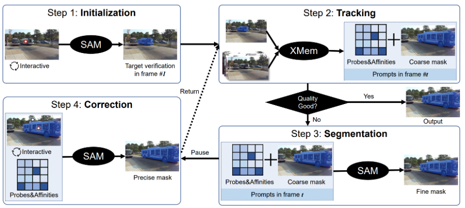

Track Anything: Segment Anything Meets Videos (TAM)

# SAM 2

SAM 2

Task: extending the promptable segmentation task to video
Interactive Video Object Segmentation (iVOS)

연속적인 이미지들이 항상 뚜렷하게 나오는 것이 아니기 때문에, SAM이 비디오 프레임에서 이미지에 대해 잘 작동하지 않을 수 있음.

모델의 오류를 interactive하게 수정할 수 있는 메커니즘이 없음.

SAM을 사용하여 오류가 있는 프레임을 다시 주석 처리하고 거기서부터 추적을 다시 시작하는 방법 외에는 해결책이 없음

# SAM 2

SAM 2

Task: extending the promptable segmentation task to video
Semi-supervised Video Object Segmentation (VOS)

첫 번째 프레임에 제공된 마스크가 객체의 외형에 대한 일종의 지도 신호로 사용되기 때문에 Semi-supervised 사용

Semi-supervised VOS는 PVS(Promptable Visual Segmentation) 작업의 특수한 사례로 볼 수 있음

첫 프레임에서의 고품질 마스크 주석이 중요한 역할을 하지만, 이를 실현하는 데에는 많은 시간과 노력이 필요

# SAM 2

SAM 2

Model: equipping the SAM architecture to use memory when applied to video

# 

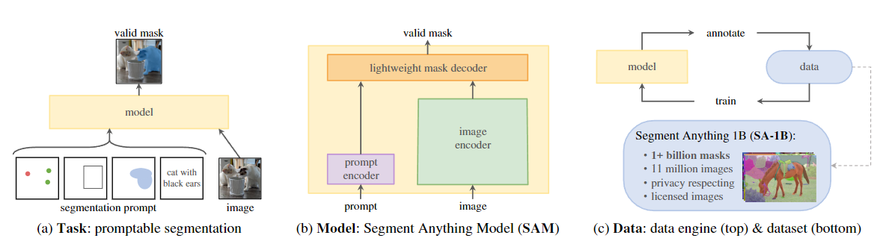

# SAM 2

SAM 2

Model: equipping the SAM architecture to use memory when applied to video

# SAM 2

SAM 2

Model: equipping the SAM architecture to use memory when applied to video

# SAM 2

SAM 2

Model: equipping the SAM architecture to use memory when applied to video

Image encoder

Video 전체에서 1번만 수행
각 frame을 나타내는 token 제공
Hiera image encoder => multiscale feature

# SAM 2

SAM 2

Model: equipping the SAM architecture to use memory when applied to video

Memory attention

과거 프레임의 feature와 예측, 그리고 새로운 프롬프트에 따라 현재 프레임의 feature를 conditioning하는 역할

# SAM 2

SAM 2

Model: equipping the SAM architecture to use memory when applied to video

Self-attention

Cross-attention

Image
Embedding
(Current
Frame)

Image
Embedding

Past frame feature & Object Ptr
(from Memory Bank)

X L(=4)

M
L
P

Image embedding
(Contextualized)

# SAM 2

SAM 2

Model: equipping the SAM architecture to use memory when applied to video

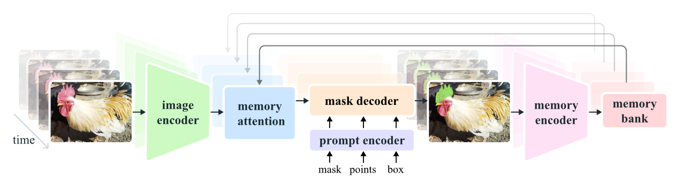

Prompt Encoder

각 프롬프트 유형(mask, points, box)에 대해 위치 인코딩과 학습된 임베딩을 합산
(마스크는 컨볼루션을 사용해 임베딩하여 프레임 임베딩과 합산)

prompt tokens

# SAM 2

SAM 2

Model: equipping the SAM architecture to use memory when applied to video

Mask Decoder

Masks / obj ptr / IoU scores / occlusion score

# SAM 2

SAM 2

Model: equipping the SAM architecture to use memory when applied to video

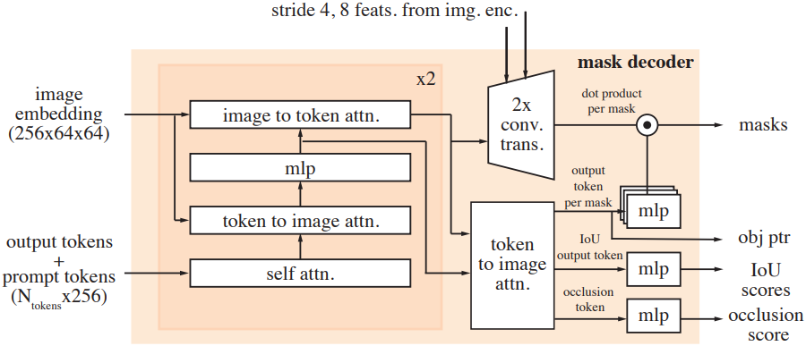

Image embedding
(Contextualized)

prompt tokens

# SAM 2

SAM 2

Model: equipping the SAM architecture to use memory when applied to video

Memory Encoder

# SAM 2

SAM 2

Model: equipping the SAM architecture to use memory when applied to video

Masks

obj ptr / IoU scores / occlusion score

Conv-module

+

(Light) Convolution
Layer

# SAM 2

SAM 2

Model: equipping the SAM architecture to use memory when applied to video

Memory Bank

메모리 뱅크는 최대 N개의 최근 프레임에 대한 메모리 FIFO 큐를 유지
동영상에서 타겟 object에 대한 과거 예측 정보를 유지
최대 M개의 prompted 프레임에 대한 FIFO 큐에 프롬프트의 정보를 저장

# SAM 2

SAM 2

Data: the diverse SA-V dataset for training and benchmarking 	video segmentation

Phase 1: SAM per frame (수동 annotate)

SAM을 사용하여 비디오의 각 프레임에서 객체 마스크를 생성

추가적으로 브러시와 지우개 같은 픽셀 정밀 수동 편집 도구를 사용

트래킹 모델은 사용되지 않으며, 각 프레임에 대해 마스크를 처음부터 다시 주석을 다는 방식

# SAM 2

SAM 2

Data: the diverse SA-V dataset for training and benchmarking 	video segmentation

Phase 2: SAM + SAM 2 Mask (시간적 속성 mask 생성)

초기 프레임에서 SAM과 다른 여러 도구를 사용하여 공간적 마스크를 생성

SAM 2 Mask를 사용하여 이 마스크를 나머지 프레임으로 시간적으로 전파 (propagate)

필요에 따라 SAM을 사용하여 마스크를 수정하고, SAM 2 Mask를 통해 다시 전파

이 과정을 반복하여 마스크를 최적화

# SAM 2

SAM 2

Data: the diverse SA-V dataset for training and benchmarking 	video segmentation

Phase 3: SAM 2 (모든 frame 대해 효과적으로 mask 생성 & 수정)

주석자가 가끔씩 수정 클릭 제공하여 refine

이전 프레임의 메모리 덕분에 중간 프레임의 마스크를 수정하기가 쉬움

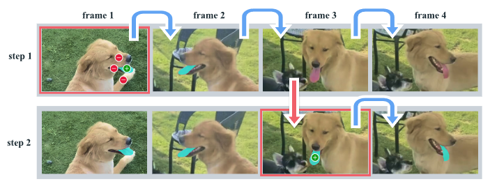

# SAM 2

SAM 2

Data: the diverse SA-V dataset for training and benchmarking 	video segmentation

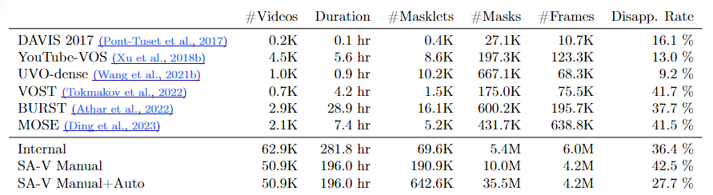

# SAM 2 Eval

SAM 2 Eval

Qualitative evaluation

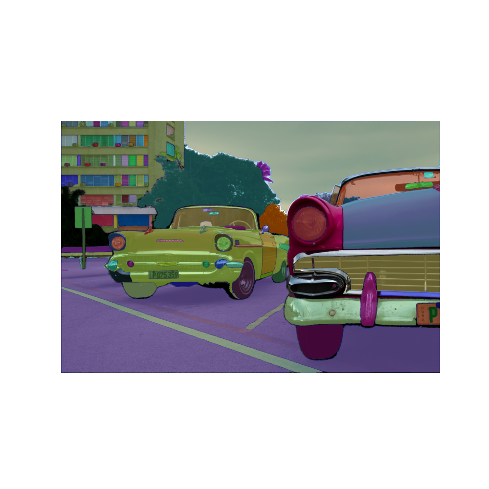

# SAM 2 Eval

SAM 2 Eval

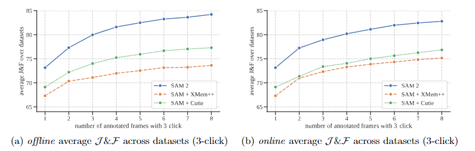

Promptable video segmentation (iVOS)
Zero-shot accuracy over 9 datasets in interactive offline and online evaluation settings.

# SAM 2 Eval

SAM 2 Eval

Semi-supervised video object segmentation (VOS)
Zero-shot accuracy across 17 video datasets under semi-supervised VOS evaluation using different prompts.

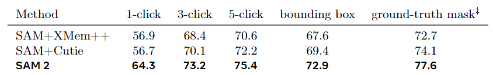

# SAM 2 Eval

SAM 2 Eval

Comparison video object segmentation (VOS)
VOS comparison to prior work.

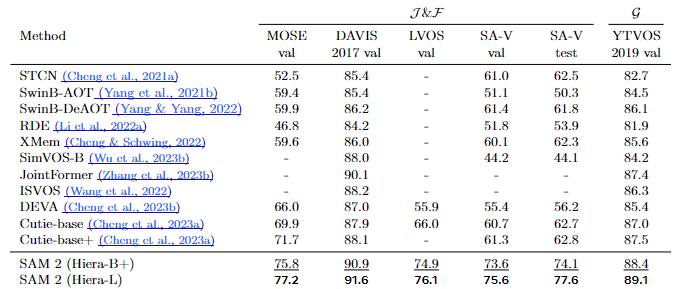

# SAM 2 Eval

SAM 2 Eval

Segmentation
Zero-shot accuracy on the Segment Anything (SA) task across 37 datasets. 

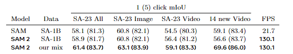

# SAM 2 Ablation

SAM 2 Ablation

Model architecture ablations

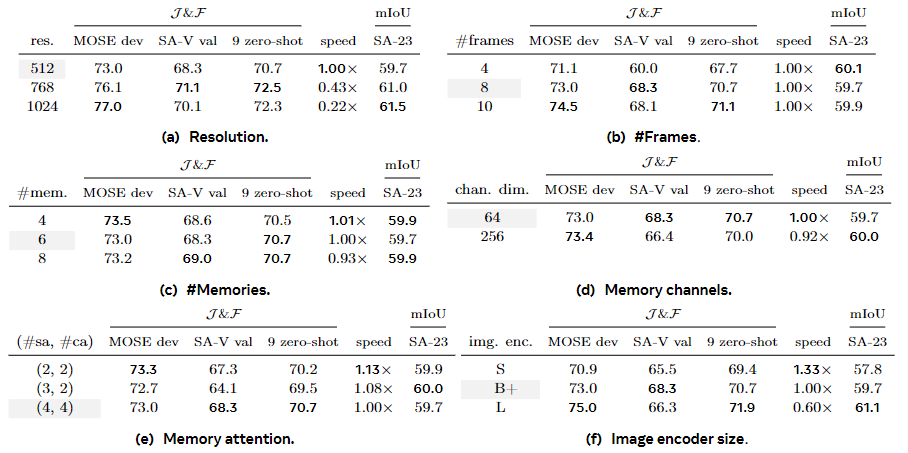

# SAM 2 Limitations

SAM 2 Limitations

혼잡한 장면, 긴 가려짐 후 또는 확장된 동영상에서 object를 추적하지 못하거나 혼동할 수 있다.

빠르게 움직이는 경우 매우 얇거나 미세한 디테일이 있는 object를 정확하게 추적하는 데 어려움을 겪는다.

비슷한 모양의 object가 근처에 있는 경우 어려움이 발생한다.

여러 object를 동시에 추적할 수 있지만 각 object를 개별적으로 처리하여 object 간 통신 없이 공유된 프레임당 임베딩만 활용한다.

데이터 엔진은 인간 annotator들에 의존하여 masklet 품질을 확인하고 수정이 필요한 프레임을 선택한다.

